# Multica Best Practices

[中文](./README.md) | English

> A highly reusable super-individual orchestration flow — from PRD to CICD.
> Practical Agent · Squad · Skill · Issue templates for [Multica](https://github.com/multica-ai/multica).
> **Copy. Paste. Run.**

This repo gives you ready-to-reuse practices that continue to be validated on real tasks.


## What this is

In one sentence: **a set of Multica squad configurations continuously refined through real tasks** — each agent owns one thing, the Leader owns orchestration and gatekeeping, and every step must produce evidence.

```text
You create: Agents (roles) + Squad (orchestration) + Skills (practices) + Issue (task)
                  ↓
       Leader runs the squad: ProductManager definition → Leader decides whether UI/technical design is needed → Leader final review → implement → test → deploy
                  ↓
   Gate each step (rerun via the multica-verification skill) → Human final acceptance
   ```

   ## Roles & responsibilities (Agent Matrix)

   | Agent | Should do | Should NOT do |
   | --- | --- | --- |
   | Architect | Design the solution | Write lots of code |
   | FrontendDev | Frontend implementation (works with the UI design) | Change requirements / self-approve / invent APIs |
   | BackendDev | Backend implementation + API contract | Change requirements / self-approve / touch UI |
   | Tester | T1/T2 cases & coverage / T3 post-deploy automation | Change requirements / run automation before G2.5 |
   | DevOps | Trigger CI/CD after G2, return deploy URL | Write business code / self-claim deploy success |
   | Reviewer | Business review (design / critical changes) | Replace objective verification / replace human acceptance |
   | Leader | Orchestration and gatekeeping (multica-verification skill) | Implement personally / rubber-stamp itself |
   | ProductLeader | Product triage, scope convergence, product review, and development handoff | Author the PRD / UI / technical design personally |
   | DevelopmentLeader | Development triage, technical staffing, development gates, and handoff | Write code personally / modify an engineer's artifact |

   > Note: the `software-development-reviewed` Starter adds dedicated Reviewers (ArchReviewer / DesignReviewer / ProductReviewer / FrontendReviewer / BackendReviewer / TestReviewer) for every regular producing role except Leader and DevOps; see Starters and [gates-and-evidence](docs/en_US/gates-and-evidence.md#two-layer-gate-generic-gate--professional-artifact-review).
   > `Product Design` uses `ProductLeader`, while `Development` and `Software Development` use `DevelopmentLeader`; the generic `Leader` remains available to `Software Development Reviewed`, `Bug Fix`, and other general-purpose Squads.

   ## Starters

   | Starter | Use | Status |
   | --- | --- | --- |
    | [Product Design](./templates/en_US/squad/product-design/README.md) | Product-feature design with ProductManager first, optional UI / feasibility work, and ProductLeader unified review | Experimental |
   | [Development](./templates/en_US/squad/development/README.md) | Development-focused flow (Leader dynamically staffs Architect / frontend / backend by complexity) | Experimental |
   | [Software Development](./templates/en_US/squad/software-development/README.md) | Regular feature development (frontend/backend routed by scope; any role can be missing) | Recommended |
   | [Software Development (Reviewed)](./templates/en_US/squad/software-development-reviewed/README.md) | Extends Software Development with a dedicated Reviewer per regular role and a two-layer gate (generic gate + professional artifact review) | Experimental |
   | [Bug Fix](./templates/en_US/squad/bug-fix/README.md) | Root cause / fix / regression (routed by impact, skips Architect) | Experimental |

   More starters (Technical Research, etc.) will be added after being validated on real tasks. **Don't pretend best practices are finished.**

   ## Repository structure

   ```text
   AGENTS.md     ⭐ Agent entry: project conventions & change rules
   templates/  ⭐ Start here: all copy-ready config
   ├── zh_CN/              Chinese templates (default; copy the whole subdir)
   │   ├── agents/           Shared Agent Instructions (17 role defs: 11 regular + 6 dedicated Reviewers)
   │   ├── skills/           Shared Skills (22, unified multica- prefix: gatekeeping / CI integration / test design / requirement analysis / technical design / implementation / artifact-orchestration / platform-shell / 6 dedicated reviews)
   │   │   └── multica-gate-setup/  CI hard-gate templates ship inside this Skill (delivery-gate.yml, etc.)
   │   └── squad/            Squad starters
    │       ├── product-design/      Product-feature design: ProductManager first + ProductLeader unified review
   │       ├── development/          Development-focused dynamic staffing
   │       ├── software-development/  Regular development (squad / issue / README incl. workflow)
   │       ├── software-development-reviewed/  Strengthened: dedicated Reviewer per role + two-layer gate
   │       └── bug-fix/              Minimal fix combination (only the orchestration changes)
   └── en_US/              English templates (mirrors zh_CN/)
   docs/          ⭐ Read this first: where instructions go / gates & evidence / common mistakes / adapt & scale
   ├── zh_CN/              Chinese methodology
   └── en_US/              English methodology
   ```

The `templates/*/squad/development` Starter is the focused option when you want development to act as an independent, composable Squad. It reuses the existing Agents and lets the Leader activate Architect, FrontendDev, and BackendDev according to task complexity.

   ## Full flow at a glance

The complete chain from a requirement coming in as an Issue to tests passing (based on `templates/en_US/squad/software-development`):

```mermaid
flowchart TB
    IN([Requirement / Idea / Issue in])

    subgraph P0["Phase 0: requirement convergence & G0"]
        direction TB
        L0["@Leader<br/>reads Issue, finds the source of truth"]
        PM["@ProductManager (mandatory first stop for product requests)<br/>multica-requirement-analysis<br/>+ multica-artifact-req-sync<br/>lightly reuses and validates existing content"]
        REQ[/"Requirement source of truth<br/>PRD or existing Issue<br/>G- FR- BR- AC- OP- RISK-"/]
        SCOPE["@Leader<br/>scope, roles present, routing<br/>declare deploy branch"]
        OP{"OP- closed & scope clear?"}
        CLARIFY["Human / @ProductManager<br/>fill gaps & open questions"]
        G0["G0 human confirmation<br/>scope, business rules, roles"]

        L0 --> PM --> REQ
        REQ --> SCOPE --> OP
        OP -->|"no"| CLARIFY --> SCOPE
        OP -->|"yes"| G0
    end

    subgraph P1["Phase 1: design, test shift-left & G1"]
        direction TB
        ARCH["@Architect (optional)<br/>multica-technical-design<br/>+ multica-artifact-design-sync"]
        DESIGNER["@Designer (optional)<br/>multica-artifact-ui-sync"]
        T1["@Tester T1 (optional)<br/>multica-test-design<br/>+ multica-artifact-test-sync"]
        R1["@Reviewer (optional)<br/>G1 business design review"]
        V1["@Leader<br/>multica-verification<br/>check design vs AC-"]
        G1{"G1 pass?"}
        FIX1["return to design role<br/>max 2 reworks"]

        ARCH --> R1
        DESIGNER --> R1
        T1 --> R1
        R1 --> V1 --> G1
        G1 -->|"FAIL"| FIX1 --> R1
    end

    subgraph P2["Phase 2: contract-first, parallel impl & G2"]
        direction TB
        API["@BackendDev (optional)<br/>publish API contract first<br/>multica-artifact-api-sync"]
        BDEV["@BackendDev (optional)<br/>multica-implementation"]
        FDEV["@FrontendDev (optional)<br/>depends on UI + API contract<br/>multica-implementation"]
        APICASE["@Tester (optional)<br/>write API cases in parallel<br/>multica-artifact-test-sync"]
        SELF["dev self-check<br/>multica-verification"]
        R2["@Reviewer (optional)<br/>G2 review"]
        V2["@Leader<br/>multica-verification<br/>rerun impl evidence"]
        G2{"G2 pass?"}
        FIX2["return to dev role<br/>with failure evidence"]
        PUSH["merge to deploy branch & push"]

        API --> BDEV
        API --> FDEV
        API --> APICASE
        BDEV --> SELF
        FDEV --> SELF
        APICASE --> R2
        SELF --> R2 --> V2 --> G2
        G2 -->|"FAIL"| FIX2 --> SELF
        G2 -->|"PASS"| PUSH
    end

    subgraph P25["Phase 2.5: coverage, CI/CD & deploy"]
        direction TB
        T2["@Tester T2 (optional)<br/>multica-test-design<br/>coverage vs AC-"]
        DEVOPS["@DevOps (optional)<br/>multica-artifact-cicd-sync<br/>(calls multica-platform-* shell)"]
        DISCOVER["discover-only<br/>copy last good params, change branch"]
        READY{"discover ready?"}
        CICD["trigger CI/CD build & deploy<br/>(platform by shell)"]
        DEPLOY[/"CI/CD evidence<br/>Build URL + log + env URL"/]
        G25["G2.5 @Leader gate<br/>verify deploy evidence"]
        FIX25["BLOCKED / FAIL<br/>fix params, pipeline, or dev"]

        DEVOPS --> DISCOVER --> READY
        READY -->|"no"| FIX25 --> DEVOPS
        READY -->|"yes"| CICD --> DEPLOY --> G25
    end

    subgraph P3["Phase 3: live automation & G3"]
        direction TB
        T3["@Tester T3 (optional)<br/>in: T1 + API cases + T2 + env URL<br/>multica-test-automation"]
        REPORT[/"Test report<br/>logs + AC- per item<br/>PASS / FAIL / BLOCKED"/]
        V3["@Leader<br/>multica-verification<br/>review test evidence"]
        G3{"G3 pass?"}
        FAIL3["FAIL: defect & return to dev"]
        BLOCK3["BLOCKED: fix env/data/access"]

        T3 --> REPORT --> V3 --> G3
        G3 -->|"FAIL"| FAIL3
        G3 -->|"BLOCKED"| BLOCK3
    end

    subgraph P4["Phase 4: human acceptance"]
        direction TB
        G4["G4 human acceptance<br/>value, risk, final release"]
        DONE([tests pass / mergeable / Done])
        REJECT["reject: rework by owner role"]
        ESC["escalate to human<br/>rework>2 / risk / conflict"]

        G4 -->|"pass"| DONE
        G4 -->|"reject"| REJECT
        REJECT -. "escalation" .-> ESC
    end

    IN --> L0
    G0 -. "scope has design" .-> ARCH
    G0 -. "scope has UI" .-> DESIGNER
    G0 -. "tester present, start T1" .-> T1
    G1 -->|"PASS"| API
    G1 -. "frontend-only, skip contract" .-> FDEV
    PUSH --> T2
    PUSH --> DEVOPS
    T2 --> T3
    G25 -->|"PASS"| T3
    G25 -->|"FAIL"| FIX25
    G3 -->|"PASS"| G4

    classDef terminal fill:#1f2937,color:#fff,stroke:#111827,stroke-width:2px;
    classDef role fill:#e8f5e9,color:#173b1b,stroke:#2e7d32,stroke-width:1.5px;
    classDef artifact fill:#f3e5f5,color:#3b1742,stroke:#8e24aa,stroke-width:1.5px;
    classDef gate fill:#ffebee,color:#56151b,stroke:#c62828,stroke-width:2px;
    classDef human fill:#eeeeee,color:#222,stroke:#616161,stroke-width:1.5px;
    classDef action fill:#fff8e1,color:#3d3100,stroke:#b58500,stroke-width:1.2px;

    class IN,DONE terminal;
    class L0,PM,SCOPE,ARCH,DESIGNER,T1,R1,V1,API,BDEV,FDEV,APICASE,SELF,R2,V2,T2,DEVOPS,T3,V3 role;
    class REQ,DEPLOY,REPORT artifact;
    class OP,G0,G1,G2,READY,G25,G3,G4 gate;
    class CLARIFY,ESC human;
    class FIX1,FIX2,PUSH,DISCOVER,CICD,FIX25,FAIL3,BLOCK3,REJECT action;
```



> Key constraints: ① every gate is independently rerun by the Leader via `multica-verification` (never trust member self-reports); ② T3 **must** dispatch only after G2.5 PASS; ③ external tools (Confluence / JIRA / Jenkins / Figma / test-case platforms) are plugged in replaceably through `multica-artifact-*-sync` and `multica-platform-*` shells — the public repo ships placeholders only; ④ once any artifact changes, its downstream gates go stale and must be re-run.

## 5-minute quick start

### Prerequisites

A **Multica environment** where you can create Agents / Squads / Skills / Issues.
Don't have one yet? Read the [Multica docs](https://www.multica.ai/docs) or [How Multica works](https://www.multica.ai/docs/how-multica-works) (3 minutes).

### Copy the software-development Starter

👉 **[`templates/en_US/squad/software-development/README.md`](./templates/en_US/squad/software-development/README.md)**

For product-first work, use **[`templates/en_US/squad/product-design/README.md`](./templates/en_US/squad/product-design/README.md)**. It uses the dedicated `ProductLeader`; every request goes through ProductManager first, Designer / Architect are activated only when needed, and ProductLeader performs the unified review before handing off a product definition package for development.

For development-only work, use **[`templates/en_US/squad/development/README.md`](./templates/en_US/squad/development/README.md)**. It uses the dedicated `DevelopmentLeader`, reuses the existing engineering Agents, lets DevelopmentLeader staff Architect, FrontendDev, and BackendDev by complexity, and hands the result to QA or deployment/operations afterward.

You get:

- 1 Squad Leader (orchestration + gatekeeping)
- The regular development Starter uses 9 Agents; the product and development Starters additionally use `ProductLeader` / `DevelopmentLeader`
- 16 Skills (`multica-verification` is the mandatory gatekeeping Skill)
- 1 Issue template (with the "affected ends" scope declaration; source supports "linked / fully self-contained" — pick one)
- 1 software-development workflow (conditional routing where any role can be missing, incl. G2.5 CI/CD)

### Step 1 — Create Agents

In Multica, create 9 Agents (naming follows [`docs/en_US/naming-conventions.md`](./docs/en_US/naming-conventions.md)) and copy the code block from the matching file under [`templates/en_US/agents/`](./templates/en_US/agents/) into each Agent's Instructions:

| Agent | Copy |
| --- | --- |
| Leader | `leader.md` (injected by Squad Instructions, usually no separate Agent needed) |
| ProductManager | `product-manager.md` |
| Architect | `architect.md` |
| Designer | `designer.md` |
| FrontendDev | `frontend-developer.md` |
| BackendDev | `backend-developer.md` |
| Tester | `tester.md` |
| Reviewer | `reviewer.md` |
| DevOps | `devops.md` |

> `leader.md` does not need a separate Agent: Squad Instructions only inject the Leader, and `squad.md` is its behavior config. Product, page, button, workflow, and UI changes always dispatch ProductManager first; an existing PRD / Issue is lightly reused and validated, not used to bypass ProductManager. A pure technical task or clearly bounded bug that changes neither product scope, business rules, nor UI may explicitly record `ProductManager N/A` through the Leader.

### Step 2 — Create Skills

In Multica, create 16 Skills, copying the code block from the matching `SKILL.md`:

| Skill | Source | Mount to |
| --- | --- | --- |
| `multica-verification` (gatekeeping, required) | [`templates/en_US/skills/multica-verification/SKILL.md`](./templates/en_US/skills/multica-verification/SKILL.md) | **Leader** |
| `multica-gate-setup` | [`templates/en_US/skills/multica-gate-setup/SKILL.md`](./templates/en_US/skills/multica-gate-setup/SKILL.md) | Leader (when integrating CI hard gates) |
| `multica-test-design` | [`templates/en_US/skills/multica-test-design/SKILL.md`](./templates/en_US/skills/multica-test-design/SKILL.md) | Tester |
| `multica-requirement-analysis` | [`templates/en_US/skills/multica-requirement-analysis/SKILL.md`](./templates/en_US/skills/multica-requirement-analysis/SKILL.md) | Leader / Architect |
| `multica-technical-design` | [`templates/en_US/skills/multica-technical-design/SKILL.md`](./templates/en_US/skills/multica-technical-design/SKILL.md) | Architect |
| `multica-implementation` | [`templates/en_US/skills/multica-implementation/SKILL.md`](./templates/en_US/skills/multica-implementation/SKILL.md) | FrontendDev / BackendDev |
| `multica-artifact-req-sync` | [`templates/en_US/skills/multica-artifact-req-sync/SKILL.md`](./templates/en_US/skills/multica-artifact-req-sync/SKILL.md) | ProductManager / Designer / Architect (initial landing and later PRD updates) |
| `multica-artifact-ui-sync` | [`templates/en_US/skills/multica-artifact-ui-sync/SKILL.md`](./templates/en_US/skills/multica-artifact-ui-sync/SKILL.md) | Designer (lands artifacts to the design platform) |
| `multica-artifact-design-sync` | [`templates/en_US/skills/multica-artifact-design-sync/SKILL.md`](./templates/en_US/skills/multica-artifact-design-sync/SKILL.md) | Architect (lands artifacts to Git / knowledge platform) |
| `multica-artifact-api-sync` | [`templates/en_US/skills/multica-artifact-api-sync/SKILL.md`](./templates/en_US/skills/multica-artifact-api-sync/SKILL.md) | BackendDev (lands artifacts to the API platform) |
| `multica-artifact-test-sync` | [`templates/en_US/skills/multica-artifact-test-sync/SKILL.md`](./templates/en_US/skills/multica-artifact-test-sync/SKILL.md) | Tester (lands artifacts to the case platform) |
| `multica-artifact-cicd-sync` | [`templates/en_US/skills/multica-artifact-cicd-sync/SKILL.md`](./templates/en_US/skills/multica-artifact-cicd-sync/SKILL.md) | DevOps (triggers CI/CD deploy) |
| `multica-test-automation` | [`templates/en_US/skills/multica-test-automation/SKILL.md`](./templates/en_US/skills/multica-test-automation/SKILL.md) | Tester (T3 automation) |
| `multica-platform-jenkins` | [`templates/en_US/skills/multica-platform-jenkins/SKILL.md`](./templates/en_US/skills/multica-platform-jenkins/SKILL.md) | platform-layer shell (CI/CD system) |
| `multica-platform-jira` | [`templates/en_US/skills/multica-platform-jira/SKILL.md`](./templates/en_US/skills/multica-platform-jira/SKILL.md) | platform-layer shell (Issue system) |
| `multica-platform-confluence` | [`templates/en_US/skills/multica-platform-confluence/SKILL.md`](./templates/en_US/skills/multica-platform-confluence/SKILL.md) | platform-layer shell (knowledge base / Wiki) |

> All 16 Skills are shared under `templates/en_US/skills/` with the unified `multica-` prefix namespace, in three classes: **gatekeeping/design** (multica-verification / multica-gate-setup / multica-test-design / multica-requirement-analysis / multica-technical-design / multica-implementation); **artifact-orchestration** (the five `multica-artifact-*-sync` + cicd-sync, landing artifacts to team platforms — the platform is implemented inside the skill and is swappable); **platform-layer shell** (multica-platform-* three + multica-test-automation, the only place allowed to hold company-internal URLs/credentials — the public repo ships placeholder shells only). Role prompts only say "which skill to use", never a platform name; switch companies by filling the platform shell. See artifact-conventions for the three-layer model. Skills mount **by name** — whoever needs one writes "use the xxx skill" in their Instructions, independent of repo paths.

### Step 3 — Create the Squad

Create a Squad and copy `templates/en_US/squad/software-development/squad.md` into the Squad Instructions.

### Step 4 — Create the Issue

Copy `templates/en_US/squad/software-development/issue.md` into a new Issue: if requirements already live in Jira/Tapd, pick "External link" and fill only the link + affected ends; otherwise pick "Fully self-contained" and fill everything.

### Step 5 — Assign

Assign the Issue to this Squad.

### Step 6 — Run

During implementation, dispatch API test cases in parallel as soon as the API contract is ready; the test report follows the relevant implementation and API-test gates.

```text
Issue → [Design] → [API contract ∥ feature cases] → [Frontend ∥ Backend implementation] → [G2.5 CI/CD deploy] → [T3 testing] → Human
```

The Leader gatekeeps every artifact with the multica-verification skill; only PASS moves to the next stage. Roles outside the scope are skipped; design and critical changes get a business review from the Reviewer; after G2, DevOps triggers CI/CD (G2.5), and the Tester runs automation in that deploy env (T3).
That's it. Run one real requirement, then tune it to your team.

## Where does an instruction go?

| I want to tell the agent… | Put it in |
| --- | --- |
| "What we're doing this time" | Issue |
| "What background does this project have" | Project Instructions |
| "What role are you" | Agent Instructions |
| "Who is responsible for what" | Squad Instructions |
| "How to do a certain kind of check" | Skill |
| "Tests must pass" | CI (engineering system) |
| "Who decides what ships" | Human |

```text
Issue   = What are we doing?
Project = What should we know?
Agent   = What is my job?
Squad   = Who does what?
Skill   = How do I do it?
CI / PR = What must actually pass?
```

## Principles

1. Keep agent responsibilities narrow.
2. Don't copy routing logic into every Agent.
3. Let the Squad Leader do the coordination.
4. Never let the completer approve their own work (the gatekeeping action is standardized as the multica-verification skill, executed by the non-producing Leader or CI).
5. Require evidence instead of a verbal "it's done".
6. Don't use natural-language instructions as hard constraints.
7. Try a simple flow before a complex multi-agent one.
8. Retry on transient failures.
9. Restart a new session on wrong direction; don't push through.
10. Keep human approval at important irreversible boundaries.

> **Instructions are guidance, not a safety boundary.** Rules that must be obeyed live outside the LLM: tests, lint, build, CI, branch protection, PR approval. Don't rely on "the agent was asked not to do this."

## Two gate modes

Every Squad workflow in this repo uses the "stage gate + evidence" framework, but gate depth comes in two modes, chosen by how much assurance you need:

| Mode | Gate layers | Review trigger | Use |
| --- | --- | --- | --- |
| Default (software-development / bug-fix) | 1: Leader generic gate (multica-verification skill) | G1 single-point business review only | general collaboration, early phase, no strong assurance need |
| Strengthened (software-development-reviewed) | 2: generic gate + per-role dedicated Reviewer professional review | Leader dispatches dedicated Reviewer after generic-gate PASS | high professional bar, artifacts must be defensible |

**How the two layers run** (strengthened mode): producing role finishes → Leader reruns multica-verification on acceptance/process ("correct?") → after PASS, dispatch the dedicated Reviewer with multica-review-* for professional analysis ("professional?") → release only on review PASS; on FAIL the dedicated Reviewer reports to Leader, who dispatches the author to fix, then re-reviews — max 3 rounds, still FAIL → escalate to human. Either layer FAIL returns; rounds counted independently but share the "3-strike cap".

Dedicated Reviewers map one-to-one to producing roles (architecture / UI / requirements / frontend / backend / testing), don't modify on the author's behalf, and report to the Leader; Leader and DevOps get no dedicated Reviewer. See [gates-and-evidence](docs/en_US/gates-and-evidence.md#two-layer-gate-generic-gate--professional-artifact-review).

Details:

| Doc | Content |
| --- | --- |
| [where-to-put-things](docs/en_US/where-to-put-things.md) | Where instructions belong — cheat sheet (most worth reading) |
| [artifact-conventions](docs/en_US/artifact-conventions.md) | Collaboration artifact conventions: content spec + sync skill (platforms are not written into role prompts; they sink into `multica-artifact-*-sync` and are swappable per company) |
| [gates-and-evidence](docs/en_US/gates-and-evidence.md) | Gates G0–G4 (+G2.5 CI/CD) and evidence requirements |
| [cicd-and-test-pipeline](docs/en_US/cicd-and-test-pipeline.md) | CI/CD and test-pipeline methodology (G2.5, Tester three-phase, deploy branch) |
| [common-mistakes](docs/en_US/common-mistakes.md) | Bad → Good examples |
| [adapt-and-scale](docs/en_US/adapt-and-scale.md) | Cut down, extend, pilot, roll out |
| [naming-conventions](docs/en_US/naming-conventions.md) | Agent naming rules (role + project + member-id) |

## Relationship to related projects

| Project | Relationship |
| --- | --- |
| [Multica](https://github.com/multica-ai/multica) | The runtime and collaboration foundation (Issue, Agent, Squad, Runtime) |
| [multica-agent-workflow-template](https://github.com/wksudud/multica-agent-workflow-template) | Methodology on Agent/Skill count and routing design; can be used together |
| [oh-my-multica](https://github.com/xiaohei-info/oh-my-multica) | Production-grade deterministic DAG / Loop; this repo focuses on the Squad and gate-convention layer |

## Contributing

Please don't submit "sounds nice" prompts. A valuable contribution includes:

1. The problem it solves
2. The scenarios it fits
3. The complete template
4. At least one real example
5. Known failure cases

Real-world experience is worth more than prompt complexity. See [CONTRIBUTING.md](CONTRIBUTING.md).

## Resources

- [Multica GitHub](https://github.com/multica-ai/multica)
- [Multica docs](https://www.multica.ai/docs)
- [How Multica works](https://www.multica.ai/docs/how-multica-works)
- [Agents](https://www.multica.ai/docs/agents)
- [Squads](https://www.multica.ai/docs/squads)
- [Tasks](https://www.multica.ai/docs/tasks)

## Security

Read [SECURITY.md](SECURITY.md) before sharing configs: never upload tokens, absolute paths, or real workspaces / emails.

## License

[MIT](LICENSE)

## Friends

- [LinuxDo](https://linux.do)
