# Multica Best Practices

[English](./README.en.md) | 中文

> 一个复用度极高的超级个体编排流程（从 PRD 到 CICD）。
> 面向 [Multica](https://github.com/multica-ai/multica) 的 Agent · Squad · Skill · Issue 实战模板。
> **Copy. Paste. Run.**

本仓库给出可直接复用、并持续通过真实任务验证的实践答案。


## 这是什么

一句话：**一套面向真实任务持续迭代的 Multica 小队配置**——每个 Agent 只负责一件事，Leader 负责编排与门禁，每步产出都要证据。

```text
你创建：Agent（角色） + Squad（编排） + Skill（做法） + Issue（任务）
                  ↓
       Leader 带队：ProductManager 需求定义 → Leader 按需决定 UI/技术设计 → Leader 最终评审 → 实现 → 测试 → 部署
                  ↓
   每步门禁（multica-verification skill 复跑）→ Human 最终验收
```

## 角色与职责（Agent Matrix）

| Agent | 该做 | 不该做 |
| --- | --- | --- |
| Architect | 设计方案 | 大量写代码 |
| FrontendDev | 前端实现（对接 UI 设计） | 修改需求 / 自审自放行 / 发明 API |
| BackendDev | 后端实现 + API 契约 | 修改需求 / 自审自放行 / 处理 UI |
| Tester | T1/T2 用例与覆盖率 / T3 部署后自动化验证 | 修改需求 / 在 G2.5 前跑自动化 |
| DevOps | G2 后触发 CI/CD、回传部署 URL | 写业务代码 / 自宣部署成功 |
| Reviewer | 业务评审（设计 / 关键改动） | 替代客观验证 / 替代人类验收 |
| Leader | 编排与门禁（用 multica-verification skill） | 亲自实现 / 给自己盖章 |
| ProductLeader | 产品问题分诊、产品范围收敛、产品评审与开发交接 | 亲自写 PRD / UI / 技术方案 |
| DevelopmentLeader | 开发任务分诊、技术编排、开发门禁与交接 | 亲自写代码 / 替工程师修改 |

> 注：`software-development-reviewed` Starter 在上述角色之外，为除 Leader、DevOps 外的每个常规产出角色配备了专属 Reviewer（ArchReviewer / DesignReviewer / ProductReviewer / FrontendReviewer / BackendReviewer / TestReviewer），见 Starters 与 [gates-and-evidence](docs/zh_CN/gates-and-evidence.md#两层门禁通用门禁--专业产出物评审)。
> `Product Design` 使用 `ProductLeader`，`Development` 与 `Software Development` 使用 `DevelopmentLeader`；`Leader` 保留给 `Software Development Reviewed`、`Bug Fix` 和其他通用小队。

## Starters

| Starter | 用途 | 状态 |
| --- | --- | --- |
| [Product Design](./templates/zh_CN/squad/product-design) | 产品功能设计（ProductManager 先行 + 按需 UI / 技术可行性 + ProductLeader 统一评审） | 实验性 |
| [Development](./templates/zh_CN/squad/development) | 聚焦开发阶段（Leader 按复杂度动态编排 Architect / 前端 / 后端） | 实验性 |
| [Software Development](./templates/zh_CN/squad/software-development) | 常规功能开发（前后端按范围路由，任意角色可缺失） | 推荐 |
| [Software Development (Reviewed)](./templates/zh_CN/squad/software-development-reviewed) | 在 Software Development 基础上，每个常规角色配专属 Reviewer，两层门禁（通用门禁 + 专业产出物评审） | 实验性 |
| [Bug Fix](./templates/zh_CN/squad/bug-fix) | 根因 / 修复 / 回归（按影响面路由，跳过 Architect） | 实验性 |

更多 Starter（Technical Research 等）将基于真实任务验证后补充。**不要假装最佳实践已经完成。**

## 仓库结构

```text
AGENTS.md     ⭐ Agent 入口：项目约定与改动规范
templates/  ⭐ 从这里开始：可直接复制的全部配置
├── zh_CN/              中文模板（默认；复制整个子目录即用）
│   ├── agents/           共享 Agent Instructions（17 个角色定义：11 常规 + 6 专属 Reviewer）
│   ├── skills/           共享 Skill（22 个，统一 multica- 前缀：门禁 / 集成 CI / 测试设计 / 需求分析 / 技术设计 / 实现 / 产物编排 / 平台壳 / 6 个专属评审）
│   │   └── multica-gate-setup/  CI 硬门禁模板随 Skill 自包含（delivery-gate.yml 等）
│   └── squad/            小队 Starter
│       ├── product-design/      产品功能设计：ProductManager 先行 + ProductLeader 统一评审
│       ├── development/          聚焦开发：Leader 按复杂度动态编排
│       ├── software-development/ 常规开发（squad / issue / README 含工作流）
│       ├── software-development-reviewed/ 加强版：每角色专属 Reviewer + 两层门禁
│       └── bug-fix/             最小修复组合（只换编排）
└── en_US/              英文模板（与 zh_CN/ 结构一致）
docs/          ⭐ 先读这一页：指令放哪 / 门禁证据 / 常见错误 / 裁剪扩展
├── zh_CN/              中文方法论
└── en_US/              英文方法论
```

## 完整流程一览

一个需求从 Issue 进来到测试通过的全链路（基于 `templates/zh_CN/squad/software-development`）：

```mermaid
flowchart TB
    IN([需求 / 想法 / Issue 输入])

    subgraph P0["阶段 0：需求收敛与 G0"]
        direction TB
        L0["@Leader<br/>读取 Issue，判断事实源"]
        PM["@ProductManager（产品需求固定首站）<br/>multica-requirement-analysis<br/>+ multica-artifact-req-sync<br/>已有内容只做轻量复用校验"]
        REQ[/"需求事实源<br/>PRD 或已有 Issue<br/>G- FR- BR- AC- OP- RISK-"/]
        SCOPE["@Leader<br/>确定范围、在场角色、路由图<br/>声明 deploy branch"]
        OP{"OP- 关闭且范围明确？"}
        CLARIFY["人类 / @ProductManager<br/>补充口径与待确认项"]
        G0["G0 人工确认<br/>范围、业务规则、参与角色"]

        L0 --> PM --> REQ
        REQ --> SCOPE --> OP
        OP -->|"否"| CLARIFY --> SCOPE
        OP -->|"是"| G0
    end

    subgraph P1["阶段 1：设计、测试左移与 G1"]
        direction TB
        ARCH["@Architect（可选）<br/>multica-technical-design<br/>+ multica-artifact-design-sync<br/>Output: 技术设计稳定引用"]
        DESIGNER["@Designer（可选）<br/>multica-artifact-ui-sync<br/>Output: UI、全状态、Token、标注"]
        T1["@Tester T1（可选）<br/>multica-test-design<br/>+ multica-artifact-test-sync<br/>Output: 功能用例 + AC- 追溯"]
        R1["@Reviewer（可选）<br/>G1 业务设计评审"]
        V1["@Leader<br/>multica-verification<br/>检查设计与 AC- 对齐"]
        G1{"G1 通过？"}
        FIX1["退回对应设计角色<br/>最多返工 2 次"]

        ARCH --> R1
        DESIGNER --> R1
        T1 --> R1
        R1 --> V1 --> G1
        G1 -->|"FAIL"| FIX1 --> R1
    end

    subgraph P2["阶段 2：契约先行、并行实现与 G2"]
        direction TB
        API["@BackendDev（可选）<br/>先发布 API 契约<br/>multica-artifact-api-sync"]
        BDEV["@BackendDev（可选）<br/>multica-implementation<br/>Output: 服务端代码 + 单测"]
        FDEV["@FrontendDev（可选）<br/>依赖 UI + API 契约<br/>multica-implementation"]
        APICASE["@Tester（可选）<br/>与开发并行写接口用例<br/>multica-artifact-test-sync"]
        SELF["开发自查<br/>multica-verification"]
        R2["@Reviewer（可选）<br/>G2 业务 / 安全 / 兼容性评审"]
        V2["@Leader<br/>multica-verification<br/>独立复跑实现证据"]
        G2{"G2 通过？"}
        FIX2["退回对应开发角色<br/>附失败证据与修改清单"]
        PUSH["各端 merge 到 deploy branch 并 push"]

        API --> BDEV
        API --> FDEV
        API --> APICASE
        BDEV --> SELF
        FDEV --> SELF
        APICASE --> R2
        SELF --> R2 --> V2 --> G2
        G2 -->|"FAIL"| FIX2 --> SELF
        G2 -->|"PASS"| PUSH
    end

    subgraph P25["阶段 2.5：覆盖率评估、CI/CD 与部署"]
        direction TB
        T2["@Tester T2（可选）<br/>multica-test-design<br/>Output: 用例补充 + AC- 覆盖率评估"]
        DEVOPS["@DevOps（可选）<br/>multica-artifact-cicd-sync<br/>（内部调用 multica-platform-* 壳）"]
        DISCOVER["discover-only<br/>复制上次成功参数，仅改 deploy branch"]
        READY{"discover ready？"}
        CICD["触发 CI/CD 构建、打包、部署<br/>（平台由 platform 壳决定）"]
        DEPLOY[/"CI/CD 证据<br/>Build URL + 日志摘要 + 环境 URL"/]
        G25["G2.5 @Leader 门禁<br/>核对部署证据"]
        FIX25["BLOCKED / FAIL<br/>补参数、修流水线或退回开发"]

        DEVOPS --> DISCOVER --> READY
        READY -->|"否"| FIX25 --> DEVOPS
        READY -->|"是"| CICD --> DEPLOY --> G25
    end

    subgraph P3["阶段 3：真实环境自动化测试与 G3"]
        direction TB
        T3["@Tester T3（可选）<br/>输入: T1 + 接口用例 + T2 + 环境 URL<br/>multica-test-automation<br/>+ multica-artifact-test-sync"]
        REPORT[/"测试报告<br/>自动化日志 + AC- 逐条结果<br/>PASS / FAIL / BLOCKED"/]
        V3["@Leader<br/>multica-verification<br/>复核测试证据"]
        G3{"G3 通过？"}
        FAIL3["FAIL: 建缺陷并退回开发<br/>修复后重新经过 G2 / G2.5 / G3"]
        BLOCK3["BLOCKED: 补环境、数据或权限"]

        T3 --> REPORT --> V3 --> G3
        G3 -->|"FAIL"| FAIL3
        G3 -->|"BLOCKED"| BLOCK3
    end

    subgraph P4["阶段 4：人工验收"]
        direction TB
        G4["G4 人工验收<br/>业务价值、发布风险、最终放行"]
        DONE([测试通过 / 可合并 / Done])
        REJECT["不通过: 指定责任角色返工<br/>重新经过对应门禁"]
        ESC["统一升级人类<br/>返工超 2 次 / 安全或发布风险 / 证据矛盾"]

        G4 -->|"通过"| DONE
        G4 -->|"不通过"| REJECT
        REJECT -. "达到升级条件" .-> ESC
    end

    IN --> L0
    G0 -. "范围含技术设计" .-> ARCH
    G0 -. "范围含 UI" .-> DESIGNER
    G0 -. "Tester 在场，启动 T1" .-> T1
    G1 -->|"PASS"| API
    G1 -. "仅前端或无后端时跳过 API 契约" .-> FDEV
    PUSH --> T2
    PUSH --> DEVOPS
    T2 --> T3
    G25 -->|"PASS"| T3
    G25 -->|"FAIL"| FIX25
    G3 -->|"PASS"| G4

    classDef terminal fill:#1f2937,color:#fff,stroke:#111827,stroke-width:2px;
    classDef role fill:#e8f5e9,color:#173b1b,stroke:#2e7d32,stroke-width:1.5px;
    classDef artifact fill:#f3e5f5,color:#3b1742,stroke:#8e24aa,stroke-width:1.5px;
    classDef gate fill:#ffebee,color:#56151b,stroke:#c62828,stroke-width:2px;
    classDef human fill:#eeeeee,color:#222,stroke:#616161,stroke-width:1.5px;
    classDef action fill:#fff8e1,color:#3d3100,stroke:#b58500,stroke-width:1.2px;

    class IN,DONE terminal;
    class L0,PM,SCOPE,ARCH,DESIGNER,T1,R1,V1,API,BDEV,FDEV,APICASE,SELF,R2,V2,T2,DEVOPS,T3,V3 role;
    class REQ,DEPLOY,REPORT artifact;
    class OP,G0,G1,G2,READY,G25,G3,G4 gate;
    class CLARIFY,ESC human;
    class FIX1,FIX2,PUSH,DISCOVER,CICD,FIX25,FAIL3,BLOCK3,REJECT action;
```



> 关键约束：① 所有门禁由 Leader 用 `multica-verification` 独立复跑，不采信成员自述；② T3 **必须**等 G2.5 PASS 后才派发；③ 产物文件经 `multica-artifact-*-sync` 接入 `multica-platform-opencontent`，CI 触发仍由独立 CI 平台负责，公开仓库只保留占位配置；④ 任一产物被修改后，其下游门禁立即失效、必须重新门禁。

## 5 分钟快速开始

### 前置条件

一个 **Multica 环境**（能创建 Agent / Squad / Skill / Issue）。
还没有？先看 [Multica 文档](https://www.multica.ai/docs) 或 [How Multica works](https://www.multica.ai/docs/how-multica-works)（3 分钟）。

### 复制 software-development Starter

👉 **[`templates/zh_CN/squad/software-development`](./templates/zh_CN/squad/software-development)**

如果要先把想法或业务问题设计成经过评审的产品功能，使用 **[`templates/zh_CN/squad/product-design`](./templates/zh_CN/squad/product-design)**。它使用专属 `ProductLeader`，所有需求先经过 ProductManager，再按复杂度启用 Designer / Architect，由 ProductLeader 统一评审并输出可交给开发小队的产品定义包。

如果只需要专注完成开发阶段，使用 **[`templates/zh_CN/squad/development`](./templates/zh_CN/squad/development)**。它使用专属 `DevelopmentLeader`，复用现有工程 Agent，由 DevelopmentLeader 根据任务复杂度按需启用 Architect、FrontendDev 和 BackendDev，完成开发交接后交给测试或部署运维小队。

你将得到：

- 1 个 Squad Leader（编排 + 门禁）
- 常规开发 Starter 使用 9 个 Agent；产品与开发 Starter 额外使用 `ProductLeader` / `DevelopmentLeader`
- 16 个 Skill（其中 multica-verification 是必备门禁 Skill）
- 1 个 Issue 模板（含「涉及端」范围声明；来源支持「链接型 / 全量自包含」二选一）
- 1 个软件开发工作流（任意角色可缺失的条件路由，含 G2.5 CI/CD）

### Step 1 — 创建 Agents

在 Multica 创建 9 个 Agent（命名遵循 [`docs/zh_CN/naming-conventions.md`](./docs/zh_CN/naming-conventions.md)），把 [`templates/zh_CN/agents/`](./templates/zh_CN/agents/) 下对应文件的代码块复制到各自 Instructions：

| Agent | 复制 |
| --- | --- |
| Leader | `leader.md`（Squad Instructions 注入，通常不需单独建 Agent） |
| ProductManager | `product-manager.md` |
| Architect | `architect.md` |
| Designer | `designer.md` |
| FrontendDev | `frontend-developer.md` |
| BackendDev | `backend-developer.md` |
| Tester | `tester.md` |
| Reviewer | `reviewer.md` |
| DevOps | `devops.md` |

> `leader.md` 不需要单独建 Agent：Squad Instructions 只注入 Leader，`squad.md` 就是它的行为配置。产品、页面、按钮、流程和 UI 变化必须先派 ProductManager；已有 PRD / Issue 不能跳过，只做轻量复用校验。纯技术任务或明确 Bug 且不改变产品范围、业务规则和 UI 时，Leader 才能显式记录 `ProductManager N/A`。

### Step 2 — 创建 Skills

在 Multica 创建 16 个 Skill，把 `SKILL.md` 的代码块复制到对应 Skill（清单见下表的 16 行）：

| Skill | 来源 | 挂给谁 |
| --- | --- | --- |
| `multica-verification`（门禁，必备） | [`templates/zh_CN/skills/multica-verification/SKILL.md`](./templates/zh_CN/skills/multica-verification/SKILL.md) | **Leader** |
| `multica-gate-setup` | [`templates/zh_CN/skills/multica-gate-setup/SKILL.md`](./templates/zh_CN/skills/multica-gate-setup/SKILL.md) | Leader（集成 CI 硬门禁时） |
| `multica-test-design` | [`templates/zh_CN/skills/multica-test-design/SKILL.md`](./templates/zh_CN/skills/multica-test-design/SKILL.md) | Tester |
| `multica-requirement-analysis` | [`templates/zh_CN/skills/multica-requirement-analysis/SKILL.md`](./templates/zh_CN/skills/multica-requirement-analysis/SKILL.md) | Leader / Architect |
| `multica-technical-design` | [`templates/zh_CN/skills/multica-technical-design/SKILL.md`](./templates/zh_CN/skills/multica-technical-design/SKILL.md) | Architect |
| `multica-implementation` | [`templates/zh_CN/skills/multica-implementation/SKILL.md`](./templates/zh_CN/skills/multica-implementation/SKILL.md) | FrontendDev / BackendDev |
| `multica-artifact-req-sync` | [`templates/zh_CN/skills/multica-artifact-req-sync/SKILL.md`](./templates/zh_CN/skills/multica-artifact-req-sync/SKILL.md) | ProductManager（产物落地到需求平台） |
| `multica-artifact-ui-sync` | [`templates/zh_CN/skills/multica-artifact-ui-sync/SKILL.md`](./templates/zh_CN/skills/multica-artifact-ui-sync/SKILL.md) | Designer（产物落地到设计平台） |
| `multica-artifact-design-sync` | [`templates/zh_CN/skills/multica-artifact-design-sync/SKILL.md`](./templates/zh_CN/skills/multica-artifact-design-sync/SKILL.md) | Architect（产物落地到 Git/知识平台） |
| `multica-artifact-api-sync` | [`templates/zh_CN/skills/multica-artifact-api-sync/SKILL.md`](./templates/zh_CN/skills/multica-artifact-api-sync/SKILL.md) | BackendDev（产物落地到接口平台） |
| `multica-artifact-test-sync` | [`templates/zh_CN/skills/multica-artifact-test-sync/SKILL.md`](./templates/zh_CN/skills/multica-artifact-test-sync/SKILL.md) | Tester（产物落地到用例平台） |
| `multica-artifact-cicd-sync` | [`templates/zh_CN/skills/multica-artifact-cicd-sync/SKILL.md`](./templates/zh_CN/skills/multica-artifact-cicd-sync/SKILL.md) | DevOps（触发 CI/CD 部署） |
| `multica-test-automation` | [`templates/zh_CN/skills/multica-test-automation/SKILL.md`](./templates/zh_CN/skills/multica-test-automation/SKILL.md) | Tester（T3 自动化执行） |
| `multica-platform-jenkins` | [`templates/zh_CN/skills/multica-platform-jenkins/SKILL.md`](./templates/zh_CN/skills/multica-platform-jenkins/SKILL.md) | 平台层占位壳（CI/CD 系统） |
| `multica-platform-opencontent` | [`templates/zh_CN/skills/multica-platform-opencontent/SKILL.md`](./templates/zh_CN/skills/multica-platform-opencontent/SKILL.md) | 产物文件平台适配（oc-basic） |

> Skills 全部共享放在 `templates/zh_CN/skills/`，统一 `multica-` 前缀命名空间。产物文件由 `multica-platform-opencontent` 适配，CI 触发由独立 CI 平台适配，Issue 数据由 Multica 保存。角色提示词只说"用哪个 skill"，不写平台名；详见 artifact-conventions 的三层架构。Skill 靠**名称**挂载，谁需要就在自己的 Instructions 里写「用 xxx skill」，与仓库路径无关。

### Step 3 — 创建 Squad

创建 Squad，把 `templates/zh_CN/squad/software-development/squad.md` 复制到 Squad Instructions。

### Step 4 — 创建 Issue

把 `templates/zh_CN/squad/software-development/issue.md` 复制到新 Issue：若需求已在外部系统，选「外部系统链接」只填链接 + 涉及端即可；否则选「全量自包含」完整填写。

### Step 5 — 分配

把 Issue 分配给这个 Squad。

### Step 6 — 运行

```text
Issue → [设计] → [API 契约 ∥ 功能用例] → [前端 ∥ 后端实现 ∥ API 测试用例] → [G2.5 CI/CD 部署] → [T3 测试报告] → Human
```

每个产物的门禁由 Leader 用 multica-verification skill 执行，PASS 才进入下一阶段；范围里没有的角色直接跳过；设计与关键改动由 Reviewer 做业务评审；G2 后由 DevOps 触发 CI/CD（G2.5），Tester 在其部署环境跑自动化（T3）。
就这些。先跑一个真实需求，再按你的团队调整。

## 一条指令该放哪？

| 我想告诉 Agent…… | 放这里 |
| --- | --- |
| 「这次要做什么」 | Issue |
| 「这个项目有哪些背景」 | Project Instructions |
| 「你是什么角色」 | Agent Instructions |
| 「谁负责什么」 | Squad Instructions |
| 「怎么做某类工作」 | Skill |
| 「必须通过测试」 | CI（工程系统） |
| 「谁最终决定上线」 | Human |

```text
Issue   = 我们在做什么？
Project = 我们应该知道什么？
Agent   = 我的职责是什么？
Squad   = 谁应该做什么？
Skill   = 我该怎么做？
CI / PR = 什么必须真的通过？
```

## 原则

1. Agent 职责保持狭窄。
2. 不要把路由逻辑复制进每个 Agent。
3. 由 Squad Leader 统一协调。
4. 完成者不得审批自己的工作（门禁动作标准化为 multica-verification skill，由不产出的 Leader 或 CI 执行）。
5. 用证据代替「做完了」的口头声明。
6. 不用自然语言指令做硬性约束。
7. 复杂多 Agent 之前，先用简单流程。
8. 临时故障重试。
9. 方向错误就重启新会话，别硬推。
10. 在重要的不可逆边界保留人类审批。

> **Instructions 是引导，不是安全边界。** 必须被遵守的规则请放到 LLM 之外：测试、Lint、构建、CI、分支保护、PR 审批。不要依赖「Agent 被要求不要这样做」。

## 两种门禁模式

本仓库的 Squad 工作流统一采用「阶段门禁 + 证据」的框架，但门禁层数有两种模式，按把关强度选择：

| 模式 | 门禁层数 | 评审触发 | 适用 |
| --- | --- | --- | --- |
| 默认（software-development / bug-fix） | 1 层：Leader 通用门禁（multica-verification skill） | 仅 G1 单点业务评审 | 通用协作、起步期、无强把关要求 |
| 加强（software-development-reviewed） | 2 层：通用门禁 + 每角色专属 Reviewer 专业评审 | Leader 在通用门禁 PASS 后派专属 Reviewer | 高专业把关要求、产物须经得起推敲 |

**两层门禁怎么走**（加强模式）：产出角色完成产物 → Leader 用 multica-verification 复跑验收/流程（管「对不对」）→ PASS 后派专属 Reviewer 用 multica-review-* 做专业分析（管「专不专业」）→ 评审 PASS 才放行；FAIL 则专属 Reviewer 汇报 Leader、指派作者修改、再复审，最多 3 轮，仍不通过升级人类。两层任一 FAIL 均退回，轮次独立计数但共用「3 次上限」。

专属 Reviewer 与产出角色一一对应（架构/UI/需求/前端/后端/测试各一名），不代替作者修改、结论汇报 Leader；Leader 与 DevOps 不配专属 Reviewer。详见 [gates-and-evidence](docs/zh_CN/gates-and-evidence.md#两层门禁通用门禁--专业产出物评审)。

详细说明见：

| 文档 | 内容 |
| --- | --- |
| [sync-to-multica](docs/zh_CN/sync-to-multica.md) | 用 CLI 将中文 Skill、Agent 和启用中的 Squad 幂等同步到指定 workspace |
| [where-to-put-things](docs/zh_CN/where-to-put-things.md) | 指令归属速查表（最值得读） |
| [artifact-conventions](docs/zh_CN/artifact-conventions.md) | 协作产物约定：内容规范 + 对接 skill（平台不写进角色提示词，下沉到 `multica-artifact-*-sync`，换公司只换 skill） |
| [gates-and-evidence](docs/zh_CN/gates-and-evidence.md) | 门禁 G0–G4（+G2.5 CI/CD）与证据要求 |
| [cicd-and-test-pipeline](docs/zh_CN/cicd-and-test-pipeline.md) | CI/CD 与测试流水线方法论（G2.5、Tester 三阶段、deploy branch） |
| [common-mistakes](docs/zh_CN/common-mistakes.md) | Bad → Good 错误示范 |
| [adapt-and-scale](docs/zh_CN/adapt-and-scale.md) | 裁剪、扩展、试点推广 |
| [naming-conventions](docs/zh_CN/naming-conventions.md) | Agent 命名规范（角色+项目+成员标识） |

## 与相关项目的关系

| 项目 | 关系 |
| --- | --- |
| [Multica](https://github.com/multica-ai/multica) | 运行与协作底座（Issue、Agent、Squad、Runtime） |
| [multica-agent-workflow-template](https://github.com/wksudud/multica-agent-workflow-template) | Agent/Skill 数量与路由设计方法论，可并用 |
| [oh-my-multica](https://github.com/xiaohei-info/oh-my-multica) | 生产级确定性 DAG / Loop；本仓库偏 Squad 与门禁约定层 |

## 贡献

请不要提交「听起来不错」的 Prompt。一次有价值的贡献应包含：

1. 它解决的问题
2. 适用场景
3. 完整模板
4. 至少一个真实示例
5. 已知失败案例

实战经验比提示词复杂度更有价值。详见 [CONTRIBUTING.md](CONTRIBUTING.md)。

## 资源

- [Multica GitHub](https://github.com/multica-ai/multica)
- [Multica 文档](https://www.multica.ai/docs)
- [How Multica works](https://www.multica.ai/docs/how-multica-works)
- [Agents](https://www.multica.ai/docs/agents)
- [Squads](https://www.multica.ai/docs/squads)
- [Tasks](https://www.multica.ai/docs/tasks)

## 安全

分享配置前必读 [SECURITY.md](SECURITY.md)：禁止上传 token、绝对路径、真实 workspace / 邮箱。

## License

[MIT](LICENSE)

## 友链

- [LinuxDo](https://linux.do)
